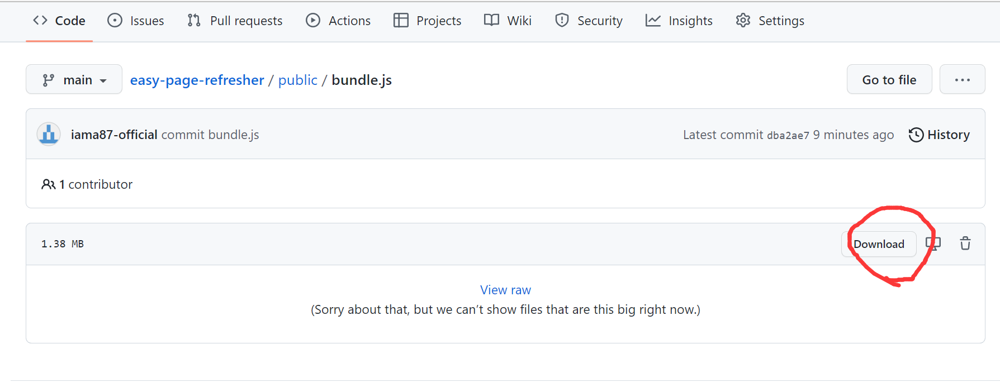
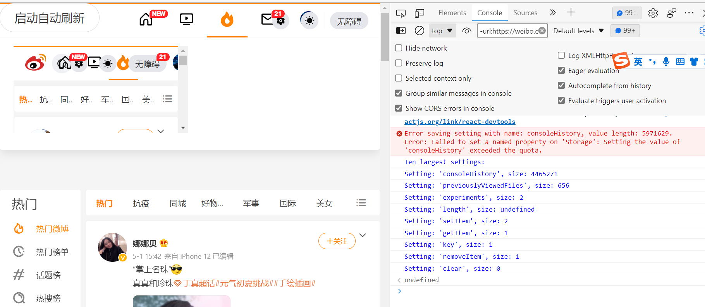

# 微博刷热度

直接粘贴复制 `public/bundle.js`。

油猴脚本和开发者console都可用。


## 油猴使用教程

1. 新建一个油猴脚本，将下列代码复制到脚本顶部。

    ```
    // ==UserScript==
    // @name        看看脚本
    // @include     *
    // @version     1
    // ==/UserScript==
    ```

2. 再将[bundle.js](https://github.com/iama87-official/easy-page-refresher/blob/main/public/bundle.js)的内容复制到脚本中，保存。

3. 进入想要刷热度的页面，打开油猴插件，打开插件【看看脚本】，左上方出现一个【启动自动刷新】的按钮，点击即可。

## 贝极星特供教程

1. 下载 [bundle.js](https://github.com/iama87-official/easy-page-refresher/blob/main/public/bundle.js)，打开文件（打开方式可以用【记事本】），按下CTRL+A复制所有代码。
   
  


2. 打开浏览器（最好是chrome、edge或firefox），进入需要刷热度的微博页面，打开 【开发者工具】（作者用的edge，按f12即可），再按下CTRL+V粘贴所有代码到Console栏，再按下enter键。

    

3. 这个时候，微博页面会出现左上方会出现一个【启动自动刷新】的按钮，还有一个小方框页面，方框页面不用管。点击【启动自动刷新】即可。
